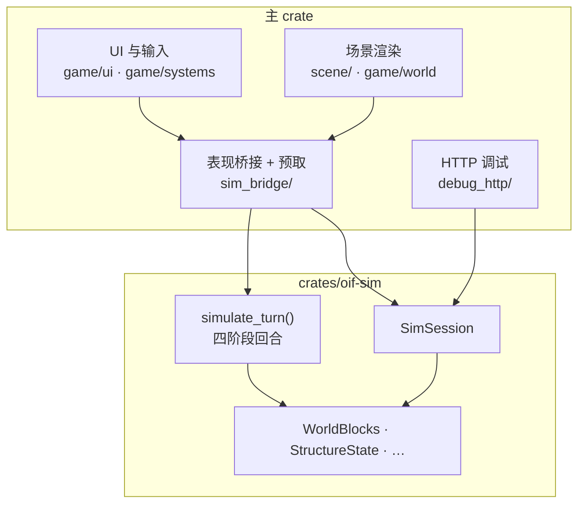

# OpenInfiniFactory

一款受 [Infinifactory](https://store.steampowered.com/app/221638/) 启发的 3D 方块工厂解谜游戏。

你在立体空间里搭传送带、接电线、摆活塞，把材料从生成点一路送到目标——也可以反过来：先设计一道谜题，再琢磨怎么用工厂方块把它解开。模拟按回合推进，你能亲眼看着整条产线动起来，一步一步调，直到通关。

玩法气质接近原作，但规则并非照搬：激光能折射、分光，传感器认得的方块也不一样。项目还在持续加新方块、新机关。

## 关于游戏

你可以当**出题人**，搭地形、放生成器和验收点，给别人（或未来的自己）出一道题；也可以当**解题人**，在谜题里补传送带和机关，把货物送到该去的地方。造错了就改，想细品过程就一格格看，想快一点就连续播放，还能随时倒带重来。

---

## 方块

下面是目前最核心的两类可放置方块。**工厂方块**是解题时用的机关与产线；**系统方块**是出题时定义「从哪来、要到哪去、中间怎么加工」的规则。有些工厂方块会在运转时自动长出焊接点、钻头之类你看不见的附属部件。

同一种方块往往有变体（比如活塞和阻拦器），按 `C` 可以切换。

### 工厂方块

造好后会跟着工厂一起受力；很多机关通电了才会动。

| 方块 | 功能 |
|------|------|
| **平台方块** | 稳稳的底座，传感器也能认出来 |
| **传送带 / 反向传送带** | 沿朝向把连在一起的东西往侧面推 |
| **活塞 / 阻拦器** | 通电后伸出去推东西，或者伸出去挡住 |
| **抬升器** | 把东西往上抬一格 |
| **旋转器 / 逆向旋转器** | 顺时针 / 逆时针转一整坨结构 |
| **焊接器 / 向下焊接器** | 在朝向那一面焊住材料，让它们连成一体 |
| **电线** | 把电信号接过去，连上要用电的机关 |
| **方块识别器 / 向下方块识别器** | 朝向面看到平台、材料或激光时，发出信号 |
| **钻头 / 激光** | 沿一条线消掉材料；激光还能触发识别器 |
| **镜子 / 垂直镜子** | 在水平 / 竖直方向拐弯激光 |
| **分光镜** | 一束激光拆成两束 |

和 Infinifactory 不太一样的地方：识别器不会什么都认，也不会顺手给旁边的机关供电；游戏里**没有计数器**这种方块。

### 系统方块

出题时摆在关卡里，自己不会跟着工厂乱飞；可以和材料叠在同一格，但不能和工厂机关抢同一格。

| 方块 | 功能 |
|------|------|
| **生成块** | 按设定定时吐出材料 |
| **验收块** | 规定这一关要交什么货才算过 |
| **印花器 / 滚刷器** | 在材料表面盖章，后面的机关能认 |
| **转换器** | 根据面上的标记，把材料变成另一种 |
| **传送入口块 / 传送出口块** | 成对使用，把材料从入口送到出口 |

东西焊在一起之后，材料会跟着一整坨走；工厂机关铺好的连通关系在运行过程中一般不会再变。

---

## 系统架构

模拟核心在独立 crate `oif-sim`；主 crate 负责表现桥接、UI、场景与 HTTP 调试。回合逻辑收敛到 `simulate_turn()`（四阶段），输出 `TurnOutput`；入口不得复制回合逻辑。



| 模块 | 职责 |
|------|------|
| `crates/oif-sim` | 世界、方块 Meta/Behavior、`simulate_turn`、无头会话；`TurnOutput` 含运动 / 激光等纯数据 DTO |
| `sim_bridge/` | 表现编排 + 预取（`present` / `SimulationWorker` / `TurnCache`）；会话类型 re-export 自 `oif-sim` |

| 运行时 | 入口 | 窗口 | 用途 |
|--------|------|------|------|
| 游戏客户端 | `cargo run` | 有 | 游玩、编辑；预取 + 增量渲染 |
| 无头模拟 | `cargo run --bin oif-debug-http` | 无 | CI、脚本 |

HTTP 调试可嵌入（`--debug-http`）或独立无头；共用 `debug_http/protocol.rs`。详见 [`docs/report/architecture.md`](docs/report/architecture.md)。

---

## 构建与运行

```bash
# 游戏客户端
cargo run

# 附带 HTTP 调试（默认 127.0.0.1:8765）
cargo run -- --debug-http

# 无头模拟 + HTTP（CI / 脚本）
cargo run --bin oif-debug-http

# E2E
cargo build --bin oif-debug-http && cd e2e && bun test
```

### 多平台打包

产物输出至 `dist/`。`src/shared/platform.rs` 统一资源路径解析；桌面端可通过 `OPEN_INFINIFACTORY_ASSET_DIR` 覆盖资源目录。

| 平台 | 脚本 |
|------|------|
| macOS | `scripts/package_macos_app.sh` |
| Linux | `scripts/package_linux.sh` |
| Windows | `scripts/package_windows.ps1` |
| Android | `scripts/package_android.sh`（[环境准备](docs/android-build.md)） |
| Web | `scripts/package_web.sh`（输出 `dist/web`；需 `~/.cargo/bin/trunk`） |

---

## 项目状态

核心玩法、工厂与系统方块、增量渲染与 HTTP 调试已贯通；关卡工具和跨平台体验仍在打磨中。
