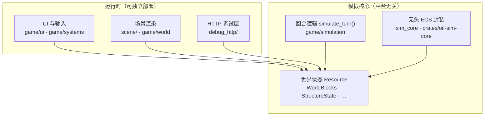

# OpenInfiniFactory

一款受 [Infinifactory](https://store.steampowered.com/app/221638/) 启发的 3D 方块工厂解谜游戏。

你在立体空间里搭传送带、接电线、摆活塞，把材料从生成点一路送到目标——也可以反过来：先设计一道谜题，再琢磨怎么用工厂方块把它解开。模拟按回合推进，你能亲眼看着整条产线动起来，一步一步调，直到通关。

玩法气质接近原作，但规则并非照搬：激光能折射、分光，传感器认得的方块也不一样。项目还在持续加新方块、新机关。

## 关于游戏

你可以当**出题人**，搭地形、放生成器和验收点，给别人（或未来的自己）出一道题；也可以当**解题人**，在谜题里补传送带和机关，把货物送到该去的地方。造错了就改，想细品过程就一格格看，想快一点就连续播放，还能随时倒带重来。

---

## 方块

下面是目前最核心的两类可放置方块。**工厂方块**是解题时用的机关与产线；**系统方块**是出题时定义「从哪来、要到哪去、中间怎么加工」的规则。有些工厂方块会在运转时自动长出焊接点、钻头之类你看不见的附属部件。

同一种方块往往有变体（比如活塞和阻拦器），按 `C` 可以切换。

### 工厂方块

造好后会跟着工厂一起受力；很多机关通电了才会动。

| 方块 | 功能 |
|------|------|
| **平台方块** | 稳稳的底座，传感器也能认出来 |
| **传送带 / 反向传送带** | 沿朝向把连在一起的东西往侧面推 |
| **活塞 / 阻拦器** | 通电后伸出去推东西，或者伸出去挡住 |
| **抬升器** | 把东西往上抬一格 |
| **旋转器 / 逆向旋转器** | 顺时针 / 逆时针转一整坨结构 |
| **焊接器 / 向下焊接器** | 在朝向那一面焊住材料，让它们连成一体 |
| **电线** | 把电信号接过去，连上要用电的机关 |
| **方块识别器 / 向下方块识别器** | 朝向面看到平台、材料或激光时，发出信号 |
| **钻头 / 激光** | 沿一条线消掉材料；激光还能触发识别器 |
| **镜子 / 垂直镜子** | 在水平 / 竖直方向拐弯激光 |
| **分光镜** | 一束激光拆成两束 |

和 Infinifactory 不太一样的地方：识别器不会什么都认，也不会顺手给旁边的机关供电；游戏里**没有计数器**这种方块。

### 系统方块

出题时摆在关卡里，自己不会跟着工厂乱飞；可以和材料叠在同一格，但不能和工厂机关抢同一格。

| 方块 | 功能 |
|------|------|
| **生成块** | 按设定定时吐出材料 |
| **验收块** | 规定这一关要交什么货才算过 |
| **印花器 / 滚刷器** | 在材料表面盖章，后面的机关能认 |
| **转换器** | 根据面上的标记，把材料变成另一种 |
| **传送入口块 / 传送出口块** | 成对使用，把材料从入口送到出口 |

东西焊在一起之后，材料会跟着一整坨走；工厂机关铺好的连通关系在运行过程中一般不会再变。

---

## 系统架构

项目按**模拟核心与表现层分离**的方式组织：回合逻辑只读写 ECS Resource，不创建场景实体、不触碰网格渲染。UI、场景渲染、HTTP 调试均作为上层消费者，依赖同一套模拟接口。



### 模拟核心

模拟核心的职责是**纯回合运算**：重力、信号网络、结构标记与执行、材料生成 / 销毁 / 焊接 / 传送、激光追踪等，统一收敛到 `simulate_turn()`，输出本回合的结构 diff 与副作用。

| 模块 | 职责 |
|------|------|
| `game/simulation/` | 游戏规则、方块行为、回合编排 |
| `sim_core/` | 无头环境下的 `SimCoreWorld`、回合控制、调试日志 |
| `crates/oif-sim-core` | 可复用的模拟内核 crate |

硬性依赖边界：`simulate_turn` 不得依赖 `Commands`、渲染资产或 UI 类型。任何入口（游戏客户端、无头服务、自动化测试）都通过 Resource 触发模拟，**不复制**回合逻辑。

### 双运行时

项目维护两个独立的 Bevy `App`，共享同一套模拟 Resource 与 `simulate_turn()`：

| 运行时 | 入口 | 窗口 / 渲染 | 典型用途 |
|--------|------|-------------|----------|
| **游戏客户端** | `cargo run` | 完整 3D 场景 + UI | 游玩、编辑、可视化调试 |
| **无头模拟器** | `cargo run --bin oif-debug-http` | 无 | CI、脚本、批量回归 |

游戏客户端在模拟之上额外挂载：

- **预计算流水线**：独立 worker 线程预演未来回合，写入 `TurnCache`；主线程按播放节奏增量应用 `TurnOutput`
- **增量渲染**：编辑期与模拟期均尽量局部刷新网格，避免全图重建

无头运行时只注册 `SimCorePlugin` 与 HTTP 服务，不加载渲染与 UI 插件，可在服务器或 CI 环境中直接驱动存档与 fixture。

### 独立调试器接入

HTTP 调试层（`debug_http/`）是模拟核心的**并列接入方**，与 UI 同级，通过统一协议读写世界状态，而不是在客户端里再实现一套模拟。

**两种接入方式：**

| 方式 | 说明 |
|------|------|
| **嵌入游戏** | 启动参数 `--debug-http`，或游戏内「设置 → 启动 HTTP 调试器」；主循环每帧 `poll_debug_http` 处理请求 |
| **独立无头服务** | `oif-debug-http` 二进制；仅启动模拟 ECS + HTTP 线程，适合自动化与远程脚本 |

两者共用 `debug_http/protocol.rs` 中的路由与 JSON 协议，例如：

- `/getPosBlock`、`/status`、`/perf` — 查询世界与帧统计
- `/runOneTurn`、`/run` — 推进模拟
- `/loadFixture`、`/runFixture` — 加载 E2E 用例并断言
- `/logs` — 读取信号、重力、运动等待机日志

无头模式通过 `SimCoreWorld::simulate_next_turn()` 直接推进回合；嵌入模式在 `Playing` 状态下复用同一 Resource 快照。E2E 测试（`e2e/`）对无头服务发 HTTP 请求，覆盖全部工厂方块的放置与派生 marker 行为。

更细的模块划分见 [`docs/report/architecture.md`](docs/report/architecture.md)；方块 trait 与能力矩阵见 [`docs/report/blocks.md`](docs/report/blocks.md)。

---

## 构建与运行

```bash
# 游戏客户端
cargo run

# 附带 HTTP 调试（默认 127.0.0.1:8765）
cargo run -- --debug-http

# 无头模拟 + HTTP（CI / 脚本）
cargo run --bin oif-debug-http

# E2E
cargo build --bin oif-debug-http && cd e2e && bun test
```

### 多平台打包

产物输出至 `dist/`。`src/shared/platform.rs` 统一资源路径解析；桌面端可通过 `OPEN_INFINIFACTORY_ASSET_DIR` 覆盖资源目录。

| 平台 | 脚本 |
|------|------|
| macOS | `scripts/package_macos_app.sh` |
| Linux | `scripts/package_linux.sh` |
| Windows | `scripts/package_windows.ps1` |
| Android | `scripts/package_android.sh` |
| Web | `trunk build --release --features webgpu --dist dist/web` |

---

## 项目状态

核心玩法、工厂与系统方块、增量渲染与 HTTP 调试已贯通；关卡工具和跨平台体验仍在打磨中。
