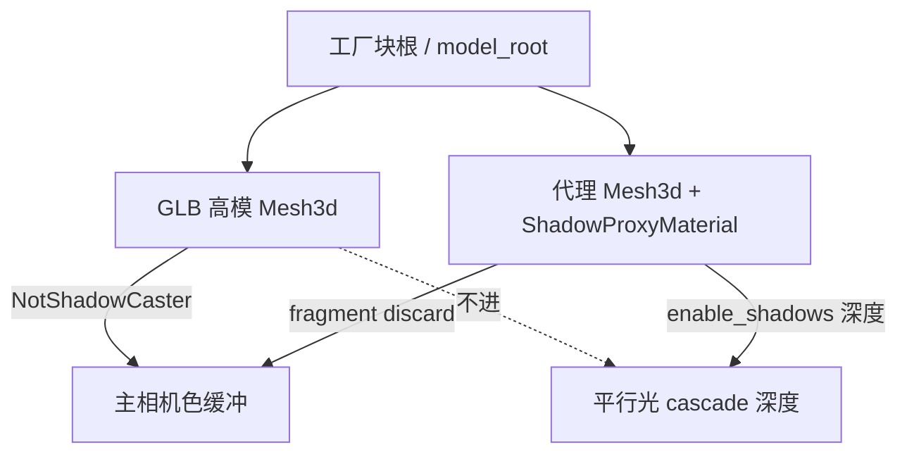

# 工厂块阴影代理（Shadow Proxy）

## 背景

工厂块多时（尤其传送带），即使不跑模拟，渲染帧也会卡。平行光阴影是 cascaded shadow map，成本大致是：

```text
阴影成本 ≈ 可见工厂 mesh 面数 × cascade 数 × 可见实例数
```

场景块已走 chunk 合并；工厂块每格多个 `Mesh3d` 默认都进阴影。做法是：**高模只给主视角看，低模只负责投影**。

当前已接入：`Conveyor` / `ReverseConveyor`（立方体）、`Drill`（立方体 + 8 边圆锥）。

## 方案定案

| 角色 | 行为 |
|------|------|
| 工厂高模（GLB 零件） | 加 `NotShadowCaster`，不进 cascade |
| 阴影代理 mesh | 粗几何；用 `ShadowProxyMaterial` |
| `ShadowProxyMaterial` | 主视角 fragment `discard`（看不见）；`enable_shadows() = true`（阴影 pass 写深度） |
| 图标 bake / icon 层 | **不**挂代理、不改高模阴影（`icon_layer.is_some()` 时跳过） |
| 放置预览 | 与落地相同：高模不投阴影 + 挂代理 |

未采用、且不要再试的路径：

- **RenderLayers 专用层 + 离屏相机**：Bevy 提取 mesh 需要 `ViewVisibility`；代理若不被任何相机「看见」就不会进渲染世界，阴影也没有。离屏相机补 `ViewVisibility` 在实践中不可靠。
- **在 `Material::specialize` 里全局关 `depth_write`**：会连阴影 pass 一起关掉，代理完全不投影。

## 关键文件

| 路径 | 作用 |
|------|------|
| [`shadow_proxy.rs`](../../src/game/world/rendering/shadow_proxy.rs) | `uses_shadow_proxy(kind)` 白名单 |
| [`shadow_proxy_material.rs`](../../src/game/world/rendering/shadow_proxy_material.rs) | `ShadowProxyMaterial` + Plugin |
| [`assets/shaders/shadow_proxy_material.wgsl`](../../assets/shaders/shadow_proxy_material.wgsl) | 主视角 discard（Metal 需 `discard` 后仍有 `return`） |
| [`model_spawn.rs`](../../src/game/blocks/model_spawn.rs) | 高模插 `NotShadowCaster`；spawn 代理子实体 |
| [`render_assets/mod.rs`](../../src/game/world/render_assets/mod.rs) | `shadow_proxy_material`、立方体（复用 `block`）、钻头圆锥 mesh |
| [`game/mod.rs`](../../src/game/mod.rs) | 注册 `ShadowProxyMaterialPlugin` |



## 运行时行为摘要

1. `spawn_factory_part`：若 `uses_shadow_proxy(kind)` 且非 icon 层 → 插入 `NotShadowCaster`。
2. `spawn_factory_static` / `spawn_factory_drill`：同条件下再 spawn 代理：
   - 传送带：`shadow_proxy_cube()`（1×1×1）
   - 钻头：立方体 + 局部 `-Z` 前一格的 8 边圆锥（**不**挂在自旋的 Head 下，避免阴影抖）
3. 材质：`enable_prepass = false`，`enable_shadows = true`；主 pass 用自定义 fragment discard。

## 后续：给新方块加代理

按复杂度选一档即可。

### A. 整格立方体就够（多数静态工厂块）

1. 在 [`shadow_proxy.rs`](../../src/game/world/rendering/shadow_proxy.rs) 的 `uses_shadow_proxy` 里加上该 `BlockKind`。
2. 确认它走 `FactoryVisual::Static` → `spawn_factory_static`（已会自动挂立方体代理）。

反向传送带与传送带同视觉，已一并列入白名单。

### B. 需要自定义粗几何（多格、伸出、细长等）

1. 仍把 kind 加入 `uses_shadow_proxy`。
2. 在 [`WorldRenderAssets`](../../src/game/world/render_assets/mod.rs) 增加代理 mesh（或复用已有）。
3. 在对应 spawn 路径（如 `spawn_factory_drill` / 将来的 pusher）里显式 spawn 代理子实体，使用：

   ```rust
   Mesh3d(assets.…),
   MeshMaterial3d(assets.shadow_proxy_material.clone()),
   Transform::…, // 局部对齐方块朝向 / 占用格
   ```

4. **动态部件**（活塞头、会动的 Stage）：代理挂在**会动的子根**上，否则影子留在原地。钻头旋转件例外：代理固定在块根，不跟 Head 转。

### C. 不要做的事

- 不要给代理加 `NotShadowCaster`。
- 不要用 `Visibility::Hidden` 藏代理（会连阴影一起裁掉）。
- 不要在 `specialize` 里无条件关闭 `depth_write`。
- 图标 / bake 路径保持 `icon_layer.is_some()` 时跳过即可，无需单独分支。

### 验收

1. 设置里打开阴影。
2. 放置预览：无高模细阴影，应有粗代理影（或至少不再投高模面）。
3. 落地后：地面/邻块上能看到粗轮廓影；主视角看不到黑色代理盒。
4. 对比：关阴影 vs 开阴影 + 代理，工厂密集存档的 Frame ms。

## 扩展优先级（建议）

| 优先级 | 种类 | 建议代理 |
|--------|------|----------|
| 已做 | Conveyor / ReverseConveyor | 立方体 |
| 已做 | Drill | 立方体 + 圆锥 |
| 高 | Wire / Pusher / Blocker / Detector | 立方体；伸出活塞可另挂头上小盒 |
| 中 | Rotator / CounterRotator / Lifter 等 | 立方体通常够用 |

场景 chunk、材料立方体维持现状（面数低或已合并），不必上代理。
