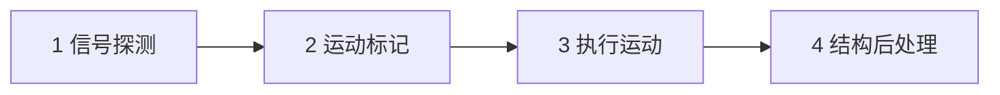

# 模拟回合四阶段

入口：`crates/oif-sim/src/simulation/core.rs` 的 `simulate_turn()`。

## 回合顺序

回合初只做准备：清生成标记、重建静态 marker。**不再**在回合初跑焊 / 传送 / 生成落地 / 销毁。

| 阶段 | 做什么 | 改世界？ |
|------|--------|----------|
| 1 信号 | 刷新信号网；**光学探测**（激光只点亮传感器）；`powered_devices` | 否（只写本回合信号结果） |
| 2 运动标记 | 重力 + 通电设备打 `StructureMove`，再 merge | 否 |
| 3 执行运动 | 统一执行移动；推杆状态；重生静态 marker | 是（仅位姿 / marker） |
| 4 结构后处理 | 销毁、传送、印花、转换、验收、生成、焊接 | 是（拓扑与材料） |

## 阶段 4 内部顺序

销毁（钻头 + 通电激光）→ 传送 → 印花 → 转换 → 验收 → 生成状态机 → 焊（含共生成焊）→ `refresh_material_structures` → 回合末信号刷新。

## 关键语义

### 传送（阶段 4，同回合）

1. 阶段 3：材料运上入口
2. 阶段 4：**立刻**送到出口（不再跨回合 pending）
3. 下一回合阶段 2：出口材料才首次参与运动标记

### 生成（阶段 4，≥1 回合动画）

1. 阶段 4：判定生成 → 只开 pending / 预览，不插入实体
2. 完整经过至少一回合动画
3. 该回合阶段 4：在生成器格落地
4. **再下一回合**阶段 2：才首次运动标记

共生成焊接在**落地当次**阶段 4 做。跨回合挂起**仅生成**保留。

### 其它

- **焊接**：阶段 4；本回合新焊块下一回合才一体移动
- **激光**：阶段 1 探测；阶段 4 销毁
- **钻头 / 验收 / 转换 / 印花**：阶段 4 当场生效

## 模块边界

| 模块 | 责任 |
|------|------|
| `core.rs` | `simulate_turn` 四阶段编排 |
| `signals.rs` | 信号网络与通电查询 |
| `gravity.rs` / `movement.rs` | 重力与设备运动标记 |
| `structures.rs` | 合并计划、统一执行移动 |
| `markers.rs` | 焊点 / 钻头头 / 阻拦器头等派生方块 |
| `behaviors.rs` | 阶段 4：销毁、传送、印花、转换、验收、生成、焊 |
| `pending.rs` / `stats.rs` | 生成挂起与计时统计 |
| `motion.rs` | `TurnOutput` 用的运动 DTO |

新增方块：优先在方块侧用 Trait 声明能力；只有新阶段能力才改对应阶段模块。
