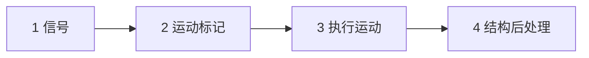
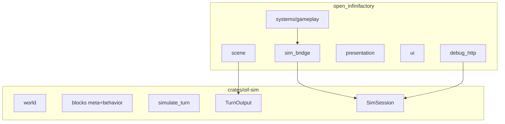

# 架构重构规范（Refactor）

目标：正确分层、便于只填内容（方块 / 设置）；不在乎迁移成本。

*来源：目标架构重构计划；执行中保持本文与代码一致。*

---

## 1. 原则

1. **依赖只允许向下**：模拟不知道渲染、UI、Bevy ECS。
2. **模拟输出是纯数据**：`TurnOutput` 不含 Bevy Component、不含 `render_*` 计时。
3. **加内容有固定落点**：新方块 = 模拟侧定义 + 可选表现侧；新设置 = 改一张声明表。
4. **不发明新框架**：不引入 GameplayTrait / RenderStrategy；大文件只按职责拆开。
5. **删假边界**：去掉反向依赖的 facade、名义 `sim_core` 倒置、重复的 `Block` 单体 trait。

---

## 2. 最终裁决：Trait 与 match

| 层 | 选什么 | 具体形态 |
|----|--------|----------|
| **声明** | **Trait** | `BlockMeta` / `BlockBehavior`（sim）；`BlockRender` / `BlockUi`（游戏）。方块只 `impl`，返回数据枚举或 None |
| **执行** | **枚举 + match** | 四阶段函数收集标签后统一 `match`；冲突与顺序只写在阶段里 |

**不做：** 执行型 Trait（`on_turn` / `on_powered` / `simulate`）；方块向阶段注册回调；把声明 Trait 扩成各方块自跑整段逻辑。

一句话：**Trait 填表；match 结算；阶段函数编排。**

---

## 3. 回合四阶段（必做）

| 阶段 | 做什么 | 改世界？ |
|------|--------|----------|
| 1 信号 | 刷新信号网；**光学探测**（激光只点亮传感器）；`powered_devices` | 否（只写本回合信号结果） |
| 2 运动标记 | 重力 + 通电设备打 `StructureMove`，再 merge | 否 |
| 3 执行运动 | 统一执行移动；推杆状态；重生静态 marker | 是（仅位姿/marker） |
| 4 结构后处理 | 焊、激光/钻头销毁、印花、转换、传送、验收、生成 | 是（拓扑与材料） |

### 3.1 传送（阶段 4，同回合）

1. 阶段 3：材料运上入口  
2. 阶段 4：**立刻**送到出口  
3. 下一回合阶段 2：出口材料才首次参与运动标记  

### 3.2 生成（阶段 4，≥1 回合动画）

1. 阶段 4：判定生成 → 只开 pending/预览，不插入实体  
2. 完整经过至少一回合动画  
3. 该回合阶段 4：在生成器格落地  
4. **再下一回合**阶段 2：才首次运动标记  

共生成焊接在**落地当次**阶段 4 做。

### 3.3 其它语义

- **焊接**：阶段 4；本回合新焊块下一回合才一体移动。  
- **激光**：阶段 1 探测；阶段 4 销毁。  
- **钻头 / 验收 / 转换 / 印花**：阶段 4 **当场生效**。  
- **跨回合挂起**：仅生成保留；传送/销毁取消跨回合 pending。  
- **回合初**：不再跑焊/传送/生成/销毁落地。  
- **阶段 4 内部顺序**：销毁 → 传送 → 印花 → 转换 → 验收 → 生成状态机 → 焊（含共生成焊）→ `refresh_material_structures`。

---

## 4. 目标依赖与目录

终态目录要点：

- `crates/oif-sim/`：模拟核心（**纯 glam/serde，无 Bevy**）；含 world、blocks meta/behavior、simulation、自有 `SimSession`；`TurnOutput` 含运动 / 激光等纯数据 DTO（属模拟输出）
- `src/sim_bridge/`：表现编排 + 预取（`present` / `SimulationWorker` / `TurnCache`）；会话类型 re-export 自 `oif-sim`
- `src/game/blocks/<kind>/{render,ui}.rs`：仅表现
- `debug_http` 只打 `SimSession`；已删除反向依赖的 `oif-sim-core` facade

---

## 5. 内容扩展约定

### 新方块

- **模拟**：`crates/oif-sim/src/blocks/<name>/{meta,behavior}` + `BlockKind`
- **表现（按需）**：`src/game/blocks/<name>/{render,ui}` + 可选 `UiPanelId`
- 面板逻辑留在 `blocks/*/ui.rs`，不迁入 `ui/features/block_panels`

### 新设置

- `ui/features/settings/types.rs` 表驱动；副作用放表现层 sync

---

## 6. 模拟侧补洞（P4b）

1. `PoweredTranslate { extend_when_powered }` — 去掉 Pusher/Blocker 的 `BlockKind` 特判  
2. `MaterialProcessor`（Converter / TeleportEntrance）  
3. `LaserOpticsBehavior`（Mirror / VerticalMirror / Splitter）  
4. helper：`adjacent_wire_components`、`resolve_teleport_pair`、`render_directional_wire_device`（表现侧）

---

## 7. 落地顺序

1. **P-sim**：四阶段重写 `simulate_turn` + e2e/单测 — **已完成**
2. **P0**：pending/stats 迁出；runtime → `sim_bridge` — **已完成**
3. **P1**：`TurnOutput` 纯 DTO — **已完成**（`simulation/motion.rs`）
4. **P2**：抽出 `oif-sim` — **已完成**
5. **P3**：翻转 Cargo；HTTP 直连 `SimSession` — **已完成**（`debug_http` 使用自有 `SimSession`，无 Bevy App）
6. **P4**：拆 gameplay/rendering；删单体 `Block` trait — **已完成**
7. **P4b**：补枚举洞 + helper — **已完成**
8. **P5**：清死代码；更新 `architecture.md` / `simulation_turn_phases.md` — **已完成**
9. **P6**：`oif-sim` 去 Bevy + 真实 `SimSession` — **已完成**

### 已知剩余债务

无架构债务。

## 8. 明确不做

- 不把 `blocks/*/ui.rs` 迁到 `ui/features/`
- 不引入阶段回调注册表 / DirectionalBlock 等执行型 trait 树
- 不给 `BlockBehavior` 加执行方法
- 不拆 `behaviors.rs` 为每方块一文件
- 不做旧存档兼容
